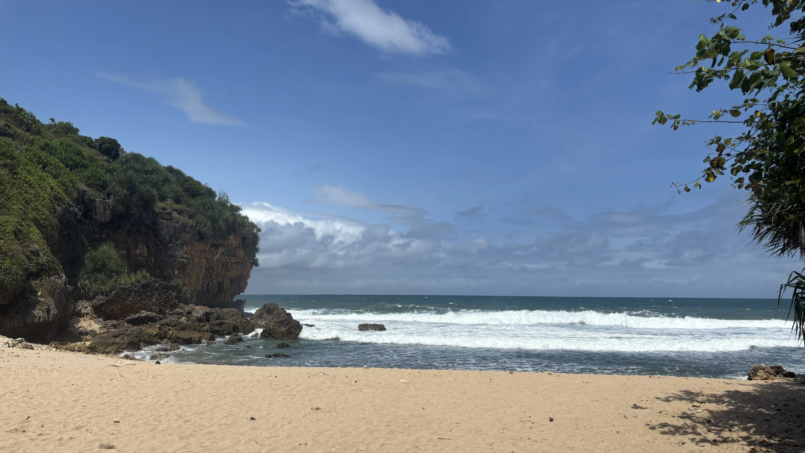

# 🏞️ Website Dusun Bedalo

<div align="center">



**A Modern, Community-Focused Village Website**

[](LICENSE)
[](https://html.spec.whatwg.org/)
[](https://tailwindcss.com/)
[](https://www.javascript.com/)

[🌐 Live Demo](https://bedalo.pages.dev) | [📖 Documentation](#documentation) | [🚀 Getting Started](#getting-started)

</div>

---

## 📋 Table of Contents

- [About](#about)
- [Features](#features)
- [Technology Stack](#technology-stack)
- [Project Structure](#project-structure)
- [Getting Started](#getting-started)
- [Pages Overview](#pages-overview)
- [Components & Modules](#components--modules)
- [Customization Guide](#customization-guide)
- [Deployment](#deployment)
- [Browser Support](#browser-support)
- [Performance](#performance)
- [Contributing](#contributing)
- [License](#license)
- [Credits](#credits)
- [Contact](#contact)

---

## 🎯 About

**Website Dusun Bedalo** is a modern, responsive, and feature-rich community website designed to showcase the beauty, culture, and potential of Dusun Bedalo, a hamlet located in Krambilsawit Village, Saptosari District, Gunungkidul Regency, Special Region of Yogyakarta, Indonesia.

This website was developed as part of the **KKN (Kuliah Kerja Nyata) Program Angkatan 117** by students from **UIN Sunan Kalijaga Yogyakarta** to support the digital transformation and community development of Dusun Bedalo.

### 🎓 Project Context

- **Program**: KKN Reguler Angkatan 117
- **Institution**: UIN Sunan Kalijaga Yogyakarta
- **Location**: Dusun Bedalo, Desa Krambilsawit, Kec. Saptosari, Kab. Gunungkidul, DIY
- **Purpose**: Digital transformation, tourism promotion, community engagement

### 🌟 Mission

The website aims to:
- Promote local tourism destinations (Pantai Ngedan, Pantai Ngluwen)
- Showcase local products and UMKM (Micro, Small, and Medium Enterprises)
- Provide transparent information about village governance
- Foster community engagement through digital platforms
- Support economic development through online exposure

---

## ✨ Features

### 🎨 User Interface & Experience
- **Fully Responsive Design** - Optimized for desktop, tablet, and mobile devices
- **Modern UI/UX** - Clean, intuitive interface with Tailwind CSS
- **Smooth Animations** - AOS (Animate On Scroll) library integration
- **Interactive Gallery** - GLightbox for beautiful image lightbox
- **Mobile-First Approach** - Mobile menu with smooth transitions
- **Accessibility Compliant** - Semantic HTML and ARIA labels

### 📱 Core Pages
1. **Homepage (Beranda)** - Hero section, village overview, featured content
2. **Profile (Profil)** - Village history, vision & mission, demographics, leadership structure
3. **Potential (Potensi)** - UMKM products, agriculture, natural resources
4. **Tourism (Pariwisata)** - Tourist destinations, accommodations, local attractions
5. **Gallery (Galeri)** - Photo collection of village activities and landscapes
6. **News (Berita)** - Latest updates, articles, and announcements
7. **Contact (Kontak)** - Contact form, location map, official contacts
8. **About KKN** - Information about the KKN team and program

### 🔧 Advanced Features
- **Product Showcase** - Dedicated pages for local products (Gula Aren, Keripik Singkong, Gaplek)
- **Accommodation Directory** - Listing of homestays and guesthouses
- **Digital Survey System** - Community digitalization survey module
- **Aspirations Dashboard** - Community feedback collection and visualization
- **Warung (Local Store) Directory** - Local businesses and services
- **Tag-based Article System** - Organized news by categories
- **Sitemap (Peta Situs)** - Complete site navigation structure
- **Privacy Policy** - GDPR-compliant privacy documentation
- **SEO Optimized** - Meta tags, robots.txt, semantic HTML
- **Fast Loading** - Optimized assets and CDN usage

### 📊 Dashboard Features
- **Real-time Statistics** - Dynamic data visualization with Chart.js
- **Responsive Charts** - Line charts, doughnut charts, bar charts
- **Data Analytics** - Community aspirations tracking and analysis
- **Date-based Filtering** - Interactive data exploration

---

## 🛠️ Technology Stack

### Frontend Technologies
| Technology | Purpose | Version |
|------------|---------|---------|
| **HTML5** | Markup & Structure | Latest |
| **CSS3** | Styling | Latest |
| **JavaScript (ES6+)** | Interactivity | Latest |
| **Tailwind CSS** | Utility-first CSS Framework | 3.x (CDN) |
| **Font Awesome** | Icon Library | 6.5.1 |
| **Google Fonts** | Typography (Poppins) | Latest |

### JavaScript Libraries
| Library | Purpose | Version |
|---------|---------|---------|
| **AOS** | Scroll Animations | 2.3.4 |
| **GLightbox** | Image Lightbox | Latest |
| **CountUp.js** | Number Animation | 2.0.7 |
| **Chart.js** | Data Visualization | 4.4.0 |
| **chartjs-adapter-date-fns** | Date Handling for Charts | Latest |

### Performance Optimizations
- **Preconnect Links** - DNS prefetching for external resources
- **Lazy Loading** - Deferred image loading
- **CDN Delivery** - Fast content delivery via CDN
- **Minified Assets** - Optimized CSS and JavaScript
- **Browser Caching** - Efficient resource caching

### Development Tools
- **Git** - Version control
- **VS Code** - Code editor (recommended)
- **Live Server** - Local development server

---

## 📁 Project Structure

```
website-bedalo/
├── 📄 index.html                 # Homepage
├── 📄 profil.html                # Village profile page
├── 📄 potensi.html               # Village potential page
├── 📄 pariwisata.html            # Tourism page
├── 📄 galeri.html                # Photo gallery
├── 📄 kontak.html                # Contact page
├── 📄 tentang-kkn.html           # About KKN team
├── 📄 kebijakan-privasi.html     # Privacy policy
├── 📄 peta-situs.html            # Sitemap
├── 📄 404.html                   # 404 error page
├── 📄 robots.txt                 # SEO robots file
├── 🖼️ icon.svg                   # Website favicon
│
├── 📂 assets/                    # Static assets
│   └── 📂 images/                # Image files
│       ├── ngedan.webp           # Beach images
│       ├── kkn-team.webp         # Team photos
│       ├── profil.jpg            # Profile pictures
│       ├── cat.jpg               # Village head photo
│       └── *.svg                 # SVG placeholders
│
├── 📂 css/                       # Stylesheets
│   └── 📄 tailwind-custom.css    # Custom Tailwind components
│
├── 📂 js/                        # JavaScript files
│   └── 📄 script.js              # Main JavaScript file
│
├── 📂 components/                # Reusable components
│   ├── 📄 header.html            # Header component
│   └── 📄 footer.html            # Footer component
│
├── 📂 berita/                    # News section
│   ├── 📄 index.html             # News listing page
│   ├── 📄 artikel-contoh.html    # Sample article
│   ├── 📂 js/
│   │   └── 📄 script.js          # News page scripts
│   └── 📂 tag/
│       └── 📄 pembangunan.html   # News by tag
│
├── 📂 potensi/                   # Local products
│   ├── 📄 gula-aren-asli.html    # Palm sugar product
│   ├── 📄 keripik-singkong.html  # Cassava chips product
│   └── 📄 gaplek.html            # Dried cassava product
│
├── 📂 pariwisata/                # Tourism destinations
│   ├── 📄 pantai-ngedan.html     # Ngedan Beach
│   └── 📄 pantai-ngluwen.html    # Ngluwen Beach
│
├── 📂 akomodasi/                 # Accommodations
│   ├── 📄 index.html             # Accommodation listing
│   └── 📄 penginapan-contoh-1.html # Sample lodging
│
├── 📂 warung/                    # Local stores
│   ├── 📄 index.html             # Store directory
│   └── 📄 warung.html            # Store details
│
├── 📂 survei/                    # Survey module
│   ├── 📄 index.html             # Survey interface
│   ├── 📂 css/
│   │   └── 📄 styles.css         # Survey styles
│   └── 📂 js/
│       └── 📄 script.js          # Survey logic
│
├── 📂 dashboard/                 # Analytics dashboard
│   ├── 📄 index.html             # Dashboard interface
│   └── 📂 js/
│       └── 📄 (dashboard scripts)
│
├── 📂 .github/                   # GitHub configurations
│   └── 📂 prompts/               # AI prompts and templates
│
├── 📂 .vscode/                   # VS Code settings
│   └── 📄 settings.json          # Editor configuration
│
└── 📄 README.md                  # This file
```

### 📊 Project Statistics
- **Total HTML Pages**: 26
- **Main Pages**: 11 (index, profil, potensi, pariwisata, galeri, kontak, tentang-kkn, peta-situs, kebijakan-privasi, 404, berita/index)
- **Product Detail Pages**: 3 (Gula Aren, Keripik Singkong, Gaplek)
- **Tourism Detail Pages**: 2 (Pantai Ngedan, Pantai Ngluwen)
- **Accommodation Pages**: 2 (index + sample)
- **Warung Pages**: 2 (index + detail)
- **Special Modules**: 2 (Dashboard, Survey)
- **CSS Files**: 4 (main custom + module-specific)
- **JavaScript Files**: 5+ (main + page-specific scripts)
- **Image Assets**: 6+ optimized images (WebP format)
- **Interactive Features**: 8 (Lightbox, CountUp, Charts, Forms, Maps, Mobile Menu, Animations, Modals)

---

## 🚀 Getting Started

### Prerequisites

To run this project locally, you need:
- A modern web browser (Chrome, Firefox, Safari, Edge)
- A local web server (optional but recommended)
- Basic knowledge of HTML/CSS/JavaScript (for customization)

### Installation & Setup

#### Method 1: Simple File Opening (Not Recommended)
```bash
# Clone the repository
git clone https://github.com/yourusername/website-bedalo.git

# Navigate to the project
cd website-bedalo

# Open index.html in your browser
# Note: Some features may not work due to CORS restrictions
```

#### Method 2: Using Python HTTP Server (Recommended)
```bash
# Clone the repository
git clone https://github.com/yourusername/website-bedalo.git

# Navigate to the project
cd website-bedalo

# Start Python HTTP Server
# For Python 3.x:
python -m http.server 8000

# For Python 2.x:
python -m SimpleHTTPServer 8000

# Open browser and visit:
# http://localhost:8000
```

#### Method 3: Using Node.js http-server
```bash
# Install http-server globally (one-time)
npm install -g http-server

# Clone and navigate to project
git clone https://github.com/yourusername/website-bedalo.git
cd website-bedalo

# Start the server
http-server -p 8000

# Open browser and visit:
# http://localhost:8000
```

#### Method 4: Using VS Code Live Server (Best for Development)
1. Install **Live Server** extension in VS Code
2. Open the project folder in VS Code
3. Right-click on `index.html`
4. Select "Open with Live Server"
5. Website opens automatically with live reload

### Quick Start Checklist

- [ ] Clone or download the repository
- [ ] Choose a local server method
- [ ] Start the server
- [ ] Open browser to `http://localhost:8000`
- [ ] Explore the website!

---

## 📖 Pages Overview

### 🏠 Homepage (`index.html`)
**Main Entry Point** - The landing page that introduces visitors to Dusun Bedalo

**Content Elements:**
- **Hero Section**: 
  - Full-viewport height banner (60vh mobile, 80vh desktop)
  - Background: Pantai Ngedan beach image
  - Heading: "Selamat Datang di Dusun Bedalo"
  - Subheading: "Menjelajahi Keindahan, Kearifan Lokal, dan Potensi Tersembunyi"
  - CTA button: "Jelajahi Sekarang" (scrolls to profile section)
  
- **Profile Section (Sambutan)**:
  - Profile photo: Village head (Sumindar) with circular frame
  - Name and title display
  - Welcome message (2 paragraphs from Kepala Dusun)
  - Link to full profile page
  
- **Potential Overview Section**:
  - Section heading: "Potensi Unggulan Dusun"
  - Three feature cards:
    1. UMKM & Produk Lokal (store icon, blue)
    2. Pertanian & Perkebunan (seedling icon, green)
    3. Pariwisata Alam (map-signs icon, purple)
  - Each card: icon, title, description, "Lihat Selengkapnya" link
  
- **Tourism Highlights Section**:
  - Heading: "Pariwisata & Kekayaan Budaya"
  - Description paragraph
  - CTA button to tourism page
  - 2x2 photo grid (4 images)
  - Hover effects with scale transform
  
- **Gallery Preview Section**:
  - Heading: "Galeri Momen Dusun Bedalo"
  - 4-column responsive grid (2 columns on mobile)
  - GLightbox integration for fullscreen viewing
  - "Lihat Galeri Lengkap" button
  
- **Animations**: AOS fade-up, fade-down, zoom-in effects throughout

### 👥 Profile Page (`profil.html`)
**Complete Village Information** - Comprehensive details about Dusun Bedalo

**Content Elements:**
- **Page Header Banner**:
  - Gradient background (blue-600 to cyan-700)
  - Title: "Tentang Dusun Bedalo"
  - Subtitle: "Mengenal Lebih Dekat Sejarah, Visi, dan Warga Kami"
  - Hover animation (lift and scale)
  
- **Sejarah Section**:
  - Two-column layout (text + image)
  - Section heading: "Sejarah Singkat"
  - Content: Origin story of "Bedalo" name, administrative info
  - Information about 3 RT and 1 RW structure
  - Side image: Dusun landscape
  
- **Visi & Misi Section**:
  - Two-card layout
  - Vision card: Eye icon, vision statement
  - Mission card: Bullseye icon, 5 bullet points
  - Both cards: white background with shadow
  
- **Struktur Pemerintahan Section**:
  - Hierarchical display:
    1. Top: Kepala Dusun (Sumindar) - solo card
    2. Middle: Ketua RW 10 (Walyono) - solo card
    3. Bottom: Three RT leaders (Sukarman, Tugiman, Sugiyanto) - 3-column grid
  - Each card: profile photo (circular), name, position
  - Hover effects: lift and scale animation
  
- **Demografi Section**:
  - Statistics with CountUp.js animations:
    1. Jumlah KK: 120 (users icon)
    2. Jumlah Warga: 450 (user-friends icon)
    3. Laki-laki: 230 (male icon, blue)
    4. Perempuan: 220 (female icon, pink)
  - Additional card: Mata Pencaharian Utama (tractor icon)
  - 4-column responsive grid (becomes single column on mobile)
  
- **Peta Wilayah Section**:
  - Google Maps embedded iframe
  - Location: Bedalo, Krambilsawit, Saptosari
  - Aspect ratio: 16:9
  - Rounded corners with shadow

### 🌾 Potential Page (`potensi.html`)
**Village Resources & Products** - Showcase of local economic potential

**Content Elements:**
- **Page Header**:
  - Gradient hero banner
  - Title: "Potensi Dusun Bedalo"
  - Description of village resources
  
- **UMKM Section** (id="umkm"):
  - Section heading: "UMKM & Produk Lokal"
  - Introduction paragraph
  - Product grid (3 columns):
    1. Gula Aren Asli
    2. Keripik Singkong
    3. Gaplek
  - Each product card:
    - Product image
    - Product name and category tag
    - Short description
    - Price indicator
    - "Lihat Detail" button linking to dedicated page
  
- **Pertanian Section** (id="pertanian"):
  - Section heading: "Pertanian & Perkebunan"
  - Description of agricultural activities
  - List of crops: cassava, corn, peanuts, sweet potatoes
  - Information about palm sugar production
  - Photo gallery of farming activities
  
- **Contact CTA Section**:
  - How to order products
  - Contact information display
  - WhatsApp integration button
  - Email contact option

**Related Product Detail Pages:**
- `/potensi/gula-aren-asli.html`: Palm sugar product page
  - Product photos
  - Detailed description
  - Production process
  - Health benefits
  - Pricing and order form
  
- `/potensi/keripik-singkong.html`: Cassava chips page
  - Various flavor options
  - Ingredients list
  - Packaging options
  - Bulk order information
  
- `/potensi/gaplek.html`: Dried cassava page
  - Traditional processing method
  - Uses and recipes
  - Storage instructions
  - Wholesale pricing

### 🏖️ Tourism Page (`pariwisata.html`)
**Tourism Destinations** - Guide to beaches and attractions

**Content Elements:**
- **Page Hero**:
  - Title: "Pariwisata & Budaya"
  - Subtitle about tourism attractions
  
- **Destinasi Section** (id="destinasi"):
  - Section heading: "Destinasi Wisata Unggulan"
  - Two main destinations featured:
  
  1. **Pantai Ngedan Card**:
     - Hero image gallery
     - Beach name and location
     - Description of features
     - Facilities list (parking, gazebo, restrooms)
     - Accessibility information
     - Best time to visit
     - "Selengkapnya" link to detail page
     
  2. **Pantai Ngluwen Card**:
     - Beach photos
     - Location details
     - Unique features description
     - Activities available
     - Access route information
     - Detail page link
  
- **Akomodasi Preview**:
  - Heading: "Tempat Menginap"
  - Intro text about accommodation options
  - Link to full accommodation directory
  
- **Tips Wisata Section**:
  - Travel recommendations
  - What to bring
  - Local etiquette
  - Safety guidelines

**Tourism Detail Pages:**
- `/pariwisata/pantai-ngedan.html`:
  - Large photo gallery
  - Detailed description
  - GPS coordinates
  - Facilities breakdown
  - Entry fee information
  - How to get there (from Yogyakarta)
  - Nearby attractions
  - Guest reviews/testimonials
  
- `/pariwisata/pantai-ngluwen.html`:
  - Beach characteristics
  - Tide information
  - Photography spots
  - Difficulty level for access
  - What makes it special
  - Conservation efforts

### 🖼️ Gallery Page (`galeri.html`)
**Photo Collection** - Visual documentation of village life

**Content Elements:**
- **Page Header**:
  - Title: "Galeri"
  - Subtitle: "Momen-momen Berharga Dusun Bedalo"
  
- **Gallery Grid**:
  - Masonry-style responsive grid
  - 4 columns on desktop, 2 on tablet, 1 on mobile
  - GLightbox integration for each image
  - Categories represented:
    - Landscapes (beaches, rice fields, sunsets)
    - Community activities (meetings, celebrations)
    - Cultural events (traditional ceremonies)
    - Infrastructure (roads, buildings, facilities)
    - Daily life (farming, market, children)
  
- **Lightbox Features**:
  - Fullscreen image viewing
  - Swipe navigation
  - Zoom capability
  - Image counter
  - Close button
  - Keyboard shortcuts
  
- **Image Optimization**:
  - Lazy loading
  - WebP format
  - Thumbnail generation
  - Alt text for accessibility

### 📰 News Page (`berita/index.html`)
**News & Updates** - Articles and announcements system

**Content Elements:**
- **Page Header**:
  - Title: "Berita & Artikel"
  - Search/filter bar (planned)
  
- **Featured Article Section**:
  - Large card for latest/featured news
  - Featured image
  - Title and excerpt
  - Publication date
  - Author name
  - Category tag
  
- **Article Grid**:
  - 3-column responsive layout
  - Each article card contains:
    - Thumbnail image
    - Category badge
    - Article title
    - Excerpt (2-3 lines)
    - Publication date
    - Read time estimate
    - "Baca Selengkapnya" button
  
- **Pagination**:
  - Page numbers
  - Previous/Next buttons
  - Shows current page indicator
  - JavaScript-based navigation
  
- **Sidebar** (on wider screens):
  - Recent articles widget
  - Category filter
  - Tag cloud
  - Popular posts

**Sample Article** (`artikel-contoh.html`):
- Full-width featured image
- Article metadata (date, author, category)
- Formatted article body
- Social share buttons
- Related articles section
- Comment section (planned)

**Tag System** (`tag/pembangunan.html`):
- Filter articles by tag
- Shows all articles with specific tag
- Tag description
- Related tags

### 📧 Contact Page (`kontak.html`)
**Communication Hub** - Multiple contact methods

**Content Elements:**
- **Page Hero**:
  - Title: "Hubungi Kami"
  - Subtitle about communication channels
  
- **Aspirasi Form Section** (id="aspirasi"):
  - Heading: "Sampaikan Aspirasi Anda"
  - Embedded Google Forms iframe
  - Form fields:
    - Nama (Name) - required
    - Email - required
    - Nomor Telepon (Phone) - optional
    - Kategori (Category) - dropdown
    - Pesan (Message) - textarea, required
  - Submit button
  - Success/error modal popup
  - Form validation
  
- **Contact Directory** (id="kontak-perangkat"):
  - Section heading: "Kontak Perangkat Dusun"
  - Contact cards for officials:
    1. Kepala Dusun
    2. Ketua RW
    3. Each RT leader
  - Each card includes:
    - Name and position
    - Phone number
    - WhatsApp quick contact button
  
- **Location Section**:
  - Section heading: "Lokasi Kami"
  - Address details
  - Google Maps embedded iframe
  - Directions link
  
- **Social Media Section**:
  - Heading: "Ikuti Kami"
  - Social media icons with links:
    - Instagram
    - YouTube
    - TikTok
    - Facebook
    - Twitter/X
  - Icon hover effects
  
- **Email & Phone Section**:
  - Primary email: inikknbedalo@gmail.com
  - Phone: +62 831-0758-1144
  - Operating hours (if applicable)

### 🎓 About KKN Page (`tentang-kkn.html`)
**KKN Team Information** - Student community service program

**Content Elements:**
- **Program Overview**:
  - Title: "KKN Reguler Angkatan 117"
  - Institution: UIN Sunan Kalijaga Yogyakarta
  - Program period/duration
  - Program objectives
  
- **Team Photo Section**:
  - Group photo of all KKN members
  - Team caption
  
- **Team Members Grid**:
  - Responsive card layout
  - Each member card:
    - Profile photo
    - Name
    - Student ID
    - Major/Faculty
    - Role in team
    - Brief bio (optional)
  
- **Program Activities**:
  - List of activities conducted
  - Timeline of events
  - Photo documentation
  - Impact summary
  
- **Achievements**:
  - List of completed projects
  - Website development mention
  - Community impact statistics
  
- **Acknowledgments**:
  - Thanks to village officials
  - Thanks to community members
  - Thanks to university supervisors

### 📦 Product Detail Pages

**Gula Aren Asli** (`potensi/gula-aren-asli.html`):
- Product hero image
- Product name and tagline
- Price: Rp X per kg
- Product description (2-3 paragraphs)
- Production process section:
  - Traditional tapping method
  - Cooking process
  - Quality control
- Benefits section:
  - Natural sweetener
  - Low glycemic index
  - Rich in minerals
  - Health advantages
- Packaging options
- Order form/contact section
- Related products

**Keripik Singkong** (`potensi/keripik-singkong.html`):
- Product gallery (multiple images)
- Available flavors:
  - Original
  - Balado
  - Keju (Cheese)
  - Bawang (Garlic)
- Ingredients list
- Nutrition information
- Packaging sizes (100g, 250g, 500g)
- Shelf life information
- Bulk order discounts
- Customer testimonials
- Order contact

**Gaplek** (`potensi/gaplek.html`):
- Product photos
- What is Gaplek (educational section)
- Traditional processing method
- Uses:
  - Animal feed
  - Industrial raw material
  - Food processing
- Storage guidelines
- Quality grades
- Pricing structure
- Wholesale inquiries contact

### 🏨 Accommodation Pages

**Accommodation Index** (`akomodasi/index.html`):
- Page heading: "Akomodasi & Penginapan"
- Introduction to lodging options
- Accommodation grid:
  - Multiple lodging cards
  - Each card shows:
    - Property photo
    - Name of homestay/guesthouse
    - Price range indicator
    - Capacity (number of rooms)
    - Amenities icons
    - Rating (if available)
    - Distance from beach
    - "Lihat Detail" button
- Filter options:
  - By price range
  - By capacity
  - By amenities
- Map showing all accommodations

**Sample Lodging Detail** (`akomodasi/penginapan-contoh-1.html`):
- Property photo gallery
- Accommodation name
- Detailed description
- Features & Amenities:
  - Room types
  - Bathroom facilities
  - Kitchen access
  - WiFi availability
  - Parking
  - Common areas
- Pricing details:
  - Per night rates
  - Weekly/monthly rates
  - Peak season pricing
- Booking information:
  - How to book
  - Payment methods
  - Cancellation policy
- Contact details:
  - Owner name and phone
  - WhatsApp booking
  - Email address
- Location map
- House rules
- Guest reviews section

### 🏪 Warung Directory

**Warung Index** (`warung/index.html`):
- Page title: "Warung & Usaha Lokal"
- Introduction to local businesses
- Business directory grid:
  - Multiple warung cards
  - Each card contains:
    - Shop/stall photo
    - Business name
    - Type of business/category
    - Products/services offered
    - Operating hours
    - Contact info
    - "Lihat Detail" link

**Warung Detail** (`warung/warung.html`):
- Business name and logo/photo
- Owner information
- Business description
- Product/service catalog:
  - Items sold
  - Price list
  - Specialties
- Operating hours:
  - Daily schedule
  - Special holiday hours
- Location:
  - Address
  - Directions
  - Map embed
- Contact methods:
  - Phone number
  - WhatsApp
  - Social media
- Payment accepted:
  - Cash
  - Digital payments (if applicable)
- Photos of products/shop

### 📊 Dashboard (`dashboard/index.html`)
**Analytics & Data Visualization** - Community aspirations monitoring

**Content Elements:**
- **Page Header**:
  - Title: "Dashboard Aspirasi Masyarakat"
  - Date range selector
  - Refresh data button
  
- **Statistics Overview**:
  - Key metrics cards:
    1. Total aspirations submitted
    2. Aspirations in progress
    3. Completed aspirations
    4. Average response time
  - Each card: icon, number (animated), label
  
- **Charts Section**:
  1. **Line Chart**:
     - Title: "Trend Aspirasi per Bulan"
     - X-axis: Months
     - Y-axis: Number of aspirations
     - Shows submission trends over time
     
  2. **Doughnut Chart**:
     - Title: "Aspirasi per Kategori"
     - Categories: Infrastructure, Economy, Education, Health, etc.
     - Shows percentage distribution
     - Interactive legend
     
  3. **Bar Chart**:
     - Title: "Status Penyelesaian"
     - Status categories: Submitted, In Review, In Progress, Completed
     - Horizontal bars with counts
  
- **Recent Aspirations Table**:
  - Columns: Date, Name, Category, Subject, Status
  - Sortable columns
  - Pagination
  - View detail button per row
  
- **Filter Panel**:
  - Date range picker
  - Category filter dropdown
  - Status filter
  - RT/RW filter
  - Apply/Reset buttons
  
- **Chart.js Implementation**:
  - Responsive charts
  - Tooltips on hover
  - Animation on load
  - Color-coded by category

### 📝 Survey Module (`survei/index.html`)
**Digital Literacy Survey** - Community digitalization assessment

**Content Elements:**
- **Survey Header**:
  - Title: "Survei Digitalisasi Masyarakat"
  - Purpose explanation
  - Estimated completion time
  - Privacy notice
  
- **Progress Indicator**:
  - Step counter (e.g., "Step 1 of 5")
  - Progress bar (visual percentage)
  - Section labels
  
- **Survey Sections**:
  1. **Personal Information**:
     - Name (required)
     - Age range (dropdown)
     - Gender (radio buttons)
     - RT/RW (dropdown)
     - Occupation (dropdown)
     
  2. **Device Ownership**:
     - Smartphone ownership (yes/no)
     - Computer/laptop ownership
     - Internet access (yes/no)
     - Internet source (WiFi/cellular data)
     
  3. **Digital Skills**:
     - Can use smartphone (scale 1-5)
     - Can browse internet
     - Can use social media
     - Can use messaging apps
     - Can use email
     
  4. **Internet Usage**:
     - Frequency of internet use
     - Primary online activities
     - Hours per day online
     - Barriers to internet use
     
  5. **Digital Services**:
     - Awareness of e-government services
     - Use of online banking
     - Use of e-commerce
     - Interest in digital training
  
- **Navigation**:
  - "Next" button (advances to next section)
  - "Previous" button (returns to previous section)
  - "Submit" button (final step)
  - Form validation before advancing
  
- **Completion**:
  - Thank you message
  - Summary of responses
  - Option to view results (aggregate)
  - Return to home button
  
- **Data Handling**:
  - Client-side validation
  - Data submitted to backend/Google Forms
  - Response stored for analysis
  - Privacy compliant

### 🗺️ Sitemap Page (`peta-situs.html`)
**Site Navigation Map** - Hierarchical list of all pages

**Content Structure:**
- Page title: "Peta Situs"
- Organized hierarchical list:
  - Beranda (/)
  - Profil (/profil.html)
    - Sejarah
    - Visi & Misi
    - Struktur Pemerintahan
    - Demografi
    - Peta Wilayah
  - Potensi (/potensi.html)
    - UMKM
    - Pertanian
    - Product pages (3 links)
  - Pariwisata (/pariwisata.html)
    - Pantai Ngedan
    - Pantai Ngluwen
  - Galeri (/galeri.html)
  - Berita (/berita/)
    - Articles
    - Tags
  - Kontak (/kontak.html)
  - Akomodasi (/akomodasi/)
  - Warung (/warung/)
  - Survei (/survei/)
  - Dashboard (/dashboard/)
  - Tentang KKN (/tentang-kkn.html)
  - Kebijakan Privasi (/kebijakan-privasi.html)
- Each link is clickable
- Organized by main sections

### 🔒 Privacy Policy (`kebijakan-privasi.html`)
**Privacy & Data Protection** - Legal information

**Content Sections:**
- Page title: "Kebijakan Privasi"
- Last updated date
- Introduction
- Information collected:
  - Personal information (names, contacts)
  - Usage data
  - Cookies
- How information is used:
  - Service improvement
  - Communication
  - Analytics
- Data protection:
  - Security measures
  - Data retention
  - Third-party services
- User rights:
  - Access to data
  - Correction requests
  - Data deletion
- Contact for privacy concerns
- Policy updates notification

### 🚫 Error Page (`404.html`)
**Custom Error Page** - User-friendly 404 handler

**Content Elements:**
- Large 404 number/graphic
- Error message: "Halaman Tidak Ditemukan"
- Friendly explanation text
- Helpful suggestions:
  - Check URL for typos
  - Use navigation menu
  - Return to homepage
- "Kembali ke Beranda" button (blue, prominent)
- Search box (optional)
- Links to main pages:
  - Profil
  - Potensi
  - Pariwisata
  - Kontak
- Consistent header/footer
- Same styling as main site
- Responsive design

---

## 🧩 Components & Modules

### Header Component
```html
<!-- Sticky navigation bar -->
- Logo/Site title
- Desktop navigation menu
- Mobile hamburger menu
- Active page highlighting
- Smooth scroll behavior
```

**Features**:
- Responsive breakpoints
- Z-index layering for modals
- Accessibility (ARIA labels)
- Mobile menu toggle animation

### Footer Component
```html
<!-- Site footer with multiple sections -->
- Village information
- Quick links
- Contact details
- Social media icons
- Copyright notice
```

**Sections**:
- Direct Links (Tautan Langsung)
- About Us (Tentang Kami)
- Contact Info (Hubungi Kami)
- Social Media (5 platforms)

### JavaScript Modules

#### Main Script (`js/script.js`)
Core functionality:
```javascript
// Mobile menu toggle
// AOS initialization
// GLightbox setup
// CountUp animations with Intersection Observer
// Form submission handling
// Modal controls
```

#### News Script (`berita/js/script.js`)
News page specific:
```javascript
// Article data management
// Pagination logic
// Dynamic content rendering
// Tag filtering
```

#### Survey Script (`survei/js/script.js`)
Survey functionality:
```javascript
// Form validation
// Multi-step navigation
// Data collection
// Progress tracking
```

#### Dashboard Script (`dashboard/js/`)
Analytics dashboard:
```javascript
// Chart.js initialization
// Data fetching and parsing
// Dynamic chart updates
// Filter controls
```

---

## 🎨 Customization Guide

### Changing Colors

The website uses a blue color scheme. To change the primary color:

1. **Update Tailwind Classes** in HTML:
```html
<!-- Replace blue-600 with your color -->
<button class="bg-blue-600 hover:bg-blue-700">
  <!-- Change to: -->
<button class="bg-purple-600 hover:bg-purple-700">
```

2. **Update Custom CSS** (`css/tailwind-custom.css`):
```css
/* Find and replace color values */
.btn-primary {
  background-color: #2563eb; /* Change this */
}
```

3. **Common Color Classes**:
- Primary: `blue-600` (#2563eb)
- Hover: `blue-700` (#1d4ed8)
- Text: `blue-600`
- Borders: `border-blue-600`

### Customizing Content

#### Update Village Information
Edit the homepage welcome section:
```html
<!-- File: index.html -->
<section id="profil">
  <h2>Sambutan Hangat dari Kami</h2>
  <p>Your custom welcome message...</p>
</section>
```

#### Change Images
1. Add your images to `assets/images/`
2. Update image sources:
```html

```

#### Modify Navigation
Edit the navigation menu:
```html
<!-- File: index.html (header section) -->
<nav>
  <a href="/your-page.html">Your Link</a>
</nav>
```

### Adding New Pages

1. **Create new HTML file**:
```bash
touch your-page.html
```

2. **Copy structure from existing page**:
```html
<!doctype html>
<html lang="id">
<head>
  <!-- Copy head section from index.html -->
</head>
<body>
  <!-- Copy header from index.html -->
  
  <main>
    <!-- Your content here -->
  </main>
  
  <!-- Copy footer from index.html -->
  <!-- Copy scripts from index.html -->
</body>
</html>
```

3. **Add to navigation menu** in all pages

### Customizing Animations

Modify AOS (Animate On Scroll) settings:
```javascript
// File: js/script.js
AOS.init({
  duration: 800,    // Animation duration (ms)
  once: true,       // Animate only once
  offset: 100,      // Trigger offset (px)
  delay: 0,         // Animation delay (ms)
  easing: 'ease',   // Easing function
});
```

Add animations to elements:
```html
<div data-aos="fade-up" data-aos-delay="200">
  Content
</div>
```

**Available Animations**:
- `fade-up`, `fade-down`, `fade-left`, `fade-right`
- `zoom-in`, `zoom-out`
- `flip-left`, `flip-right`
- `slide-up`, `slide-down`

### Font Customization

Change the font family:

1. **Update Google Fonts import** in HTML:
```html
<link href="https://fonts.googleapis.com/css2?family=Inter:wght@400;500;600;700&display=swap" rel="stylesheet" />
```

2. **Update CSS**:
```css
/* File: css/tailwind-custom.css */
body {
  font-family: "Inter", system-ui, sans-serif;
}
```

---

## 🚀 Deployment

### Deploying to Cloudflare Pages

1. **Create Cloudflare Pages project**:
```bash
# Install Wrangler CLI
npm install -g wrangler

# Login to Cloudflare
wrangler login

# Deploy
wrangler pages publish . --project-name=dusun-bedalo
```

2. **Or use Cloudflare Dashboard**:
   - Go to Cloudflare Pages
   - Connect your GitHub repository
   - Set build settings:
     - Build command: (none)
     - Build output directory: `/`
   - Deploy!

**Current deployment**: `https://bedalo.pages.dev`

### Deploying to Netlify

1. **Install Netlify CLI**:
```bash
npm install -g netlify-cli
```

2. **Deploy**:
```bash
# Login to Netlify
netlify login

# Initialize site
netlify init

# Deploy
netlify deploy --prod
```

3. **Or use Netlify Dashboard**:
   - Drag and drop the project folder
   - Automatic deployment

### Deploying to Vercel

```bash
# Install Vercel CLI
npm install -g vercel

# Deploy
vercel

# Production deployment
vercel --prod
```

### Deploying to GitHub Pages

1. **Create repository** on GitHub
2. **Push your code**:
```bash
git init
git add .
git commit -m "Initial commit"
git branch -M main
git remote add origin https://github.com/yourusername/website-bedalo.git
git push -u origin main
```

3. **Enable GitHub Pages**:
   - Go to repository Settings
   - Scroll to "Pages"
   - Select branch: `main`
   - Folder: `/ (root)`
   - Save

4. **Access at**: `https://yourusername.github.io/website-bedalo/`

### Deploying to Traditional Hosting (cPanel)

1. **Prepare files**:
```bash
# Create zip archive
zip -r website-bedalo.zip . -x "*.git*" ".vscode/*"
```

2. **Upload via cPanel**:
   - Login to cPanel
   - Go to File Manager
   - Navigate to `public_html`
   - Upload zip file
   - Extract files

3. **Or use FTP**:
```bash
# Using lftp
lftp ftp://username@yourserver.com
cd public_html
mirror -R website-bedalo/
```

---

## 🌐 Browser Support

### Supported Browsers

| Browser | Minimum Version | Recommended |
|---------|----------------|-------------|
| Chrome | 90+ | Latest |
| Firefox | 88+ | Latest |
| Safari | 14+ | Latest |
| Edge | 90+ | Latest |
| Opera | 76+ | Latest |
| Samsung Internet | 14+ | Latest |

### Mobile Support

- ✅ iOS Safari 14+
- ✅ Chrome for Android
- ✅ Firefox for Android
- ✅ Samsung Internet
- ✅ UC Browser
- ✅ Opera Mobile

### Feature Detection

The website uses modern JavaScript features:
- ES6+ syntax (arrow functions, template literals)
- Fetch API
- IntersectionObserver API
- CSS Grid & Flexbox
- CSS Custom Properties (variables)

### Fallbacks

For older browsers:
- Graceful degradation for animations
- Polyfills loaded via CDN when needed
- Alternative layouts for non-grid browsers

---

## ⚡ Performance

### Optimization Techniques

1. **Image Optimization**:
   - WebP format for modern browsers
   - Lazy loading with `loading="lazy"`
   - Responsive images with `srcset`
   - Optimized dimensions
   - Compressed file sizes

2. **CSS Optimization**:
   - Tailwind CSS purged (in production)
   - Critical CSS inlined
   - Minimal custom CSS
   - CSS combined and minified

3. **JavaScript Optimization**:
   - Deferred script loading
   - Async loading for non-critical scripts
   - Event delegation
   - Intersection Observer for animations
   - Minimal DOM manipulation

4. **Network Optimization**:
   - CDN for libraries
   - DNS prefetch/preconnect
   - Browser caching
   - Gzip compression
   - HTTP/2 multiplexing

### Performance Metrics

Target Lighthouse scores:
- **Performance**: 90+
- **Accessibility**: 95+
- **Best Practices**: 95+
- **SEO**: 100

### Loading Times

Expected loading times (3G network):
- **First Contentful Paint**: < 2s
- **Time to Interactive**: < 4s
- **Largest Contentful Paint**: < 3s
- **Total Blocking Time**: < 300ms
- **Cumulative Layout Shift**: < 0.1

### Testing Performance

```bash
# Using Lighthouse CLI
npm install -g lighthouse
lighthouse http://localhost:8000 --view

# Using WebPageTest
# Visit https://www.webpagetest.org/

# Using Chrome DevTools
# Open DevTools > Lighthouse tab > Generate Report
```

---

## 🤝 Contributing

We welcome contributions! Here's how you can help:

### Contribution Guidelines

1. **Fork the repository**
2. **Create a feature branch**:
```bash
git checkout -b feature/amazing-feature
```

3. **Make your changes**:
   - Follow existing code style
   - Test on multiple browsers
   - Ensure responsive design
   - Add comments for complex logic

4. **Commit your changes**:
```bash
git commit -m "Add amazing feature"
```

5. **Push to the branch**:
```bash
git push origin feature/amazing-feature
```

6. **Open a Pull Request**

### Code Style Guide

#### HTML
- Use semantic HTML5 elements
- Proper indentation (2 spaces)
- Alt text for all images
- ARIA labels for accessibility

#### CSS
- Follow BEM naming convention for custom classes
- Use Tailwind utility classes when possible
- Mobile-first approach
- Consistent spacing

#### JavaScript
- ES6+ syntax
- Descriptive variable names
- Comments for complex logic
- Error handling
- No console.log in production

### Areas for Contribution

- 🐛 **Bug Fixes**: Report and fix bugs
- ✨ **New Features**: Add new functionality
- 📝 **Documentation**: Improve docs
- 🎨 **Design**: UI/UX improvements
- 🌍 **Translations**: Add language support
- ♿ **Accessibility**: Enhance accessibility
- ⚡ **Performance**: Optimize loading speed

### Reporting Issues

When reporting bugs, include:
- Browser and version
- Operating system
- Steps to reproduce
- Expected vs actual behavior
- Screenshots (if applicable)

---

## 📜 License

This project is licensed under the **MIT License**.

```
MIT License

Copyright (c) 2024 KKN 117 UIN Sunan Kalijaga Yogyakarta

Permission is hereby granted, free of charge, to any person obtaining a copy
of this software and associated documentation files (the "Software"), to deal
in the Software without restriction, including without limitation the rights
to use, copy, modify, merge, publish, distribute, sublicense, and/or sell
copies of the Software, and to permit persons to whom the Software is
furnished to do so, subject to the following conditions:

The above copyright notice and this permission notice shall be included in all
copies or substantial portions of the Software.

THE SOFTWARE IS PROVIDED "AS IS", WITHOUT WARRANTY OF ANY KIND, EXPRESS OR
IMPLIED, INCLUDING BUT NOT LIMITED TO THE WARRANTIES OF MERCHANTABILITY,
FITNESS FOR A PARTICULAR PURPOSE AND NONINFRINGEMENT. IN NO EVENT SHALL THE
AUTHORS OR COPYRIGHT HOLDERS BE LIABLE FOR ANY CLAIM, DAMAGES OR OTHER
LIABILITY, WHETHER IN AN ACTION OF CONTRACT, TORT OR OTHERWISE, ARISING FROM,
OUT OF OR IN CONNECTION WITH THE SOFTWARE OR THE USE OR OTHER DEALINGS IN THE
SOFTWARE.
```

### Third-Party Licenses

This project uses the following open-source libraries:
- **Tailwind CSS** - MIT License
- **Font Awesome** - Font Awesome Free License
- **AOS** - MIT License
- **GLightbox** - MIT License
- **CountUp.js** - MIT License
- **Chart.js** - MIT License

---

## 🙏 Credits

### Development Team

**KKN Reguler Angkatan 117**  
**UIN Sunan Kalijaga Yogyakarta**

### Special Thanks

- **Dusun Bedalo Community** - For support and collaboration
- **Sumindar** - Kepala Dusun Bedalo
- **Village Officials** - For providing information and resources
- **Local UMKM Owners** - For showcasing their products
- **Residents** - For their participation and feedback

### Technologies & Resources

- [Tailwind CSS](https://tailwindcss.com/) - CSS Framework
- [Font Awesome](https://fontawesome.com/) - Icon Library
- [Google Fonts](https://fonts.google.com/) - Typography
- [AOS](https://michalsnik.github.io/aos/) - Animation Library
- [GLightbox](https://biati-digital.github.io/glightbox/) - Lightbox
- [Chart.js](https://www.chartjs.org/) - Charting Library
- [Cloudflare Pages](https://pages.cloudflare.com/) - Hosting

### Inspiration

This project was inspired by:
- Modern village digitalization initiatives
- Community-driven development projects
- Open-source web templates
- Indonesian smart village programs

---

## 📞 Contact

### Website Support

For questions or support regarding this website:

- **Email**: inikknbedalo@gmail.com
- **Phone**: +62 831-0758-1144
- **Location**: Dusun Bedalo, Desa Krambilsawit, Kec. Saptosari, Kab. Gunungkidul, DIY

### Social Media

Stay connected with Dusun Bedalo:

- **Instagram**: [@your-instagram](https://instagram.com/your-username)
- **YouTube**: [Your Channel](https://youtube.com/your-channel)
- **TikTok**: [@your-tiktok](https://tiktok.com/@your-username)
- **Facebook**: [Your Page](https://facebook.com/your-profile)
- **Twitter/X**: [@your-handle](https://x.com/your-handle)

### Project Repository

- **GitHub**: [github.com/yourusername/website-bedalo](https://github.com/yourusername/website-bedalo)
- **Issues**: Report bugs or request features
- **Discussions**: Community discussions and Q&A

---

## 🗺️ Roadmap

### Upcoming Features

#### Phase 1 (Q1 2025)
- [ ] Multi-language support (English, Javanese)
- [ ] Advanced search functionality
- [ ] User comments on news articles
- [ ] Newsletter subscription
- [ ] Enhanced mobile app (PWA)

#### Phase 2 (Q2 2025)
- [ ] E-commerce integration for UMKM
- [ ] Online booking system for accommodations
- [ ] Interactive 360° virtual tours
- [ ] Live chat support
- [ ] Advanced analytics dashboard

#### Phase 3 (Q3 2025)
- [ ] Mobile applications (iOS/Android)
- [ ] Community forum
- [ ] Event management system
- [ ] Digital payment integration
- [ ] Visitor statistics and heatmaps

#### Long-term Goals
- [ ] Smart village IoT integration
- [ ] AI-powered chatbot
- [ ] Augmented reality features
- [ ] Community mobile app
- [ ] Integration with government systems

---

## 📚 Additional Resources

### Documentation

- [HTML5 Specification](https://html.spec.whatwg.org/)
- [CSS3 Reference](https://developer.mozilla.org/en-US/docs/Web/CSS)
- [JavaScript Guide](https://developer.mozilla.org/en-US/docs/Web/JavaScript/Guide)
- [Tailwind CSS Docs](https://tailwindcss.com/docs)

### Tutorials & Guides

- [Responsive Web Design](https://web.dev/responsive-web-design-basics/)
- [Web Accessibility](https://www.w3.org/WAI/fundamentals/)
- [SEO Best Practices](https://developers.google.com/search/docs)
- [Web Performance](https://web.dev/performance/)

### Community

- [Stack Overflow](https://stackoverflow.com/) - Q&A
- [MDN Web Docs](https://developer.mozilla.org/) - Reference
- [CSS-Tricks](https://css-tricks.com/) - CSS Tips
- [Smashing Magazine](https://www.smashingmagazine.com/) - Web Design

---

## 🎉 Acknowledgments

This website is a testament to the power of community collaboration and digital transformation. We are grateful to everyone who contributed to making this project a reality.

### Impact

- **Digital Presence**: Establishing Dusun Bedalo's online identity
- **Tourism Promotion**: Showcasing local attractions to wider audience
- **Economic Development**: Supporting local UMKM through online exposure
- **Community Engagement**: Facilitating citizen participation
- **Knowledge Sharing**: Documenting village history and culture

### Future Vision

We envision this website as a catalyst for Dusun Bedalo's continued growth and development, serving as a model for digital transformation in rural communities across Indonesia.

---

<div align="center">

**Made with ❤️ by KKN 117 UIN Sunan Kalijaga Yogyakarta**

**For Dusun Bedalo, Gunungkidul, DIY**

[⬆ Back to Top](#-website-dusun-bedalo)

---

*Last Updated: October 24, 2025*

*README fully updated with comprehensive page content details*

</div>
