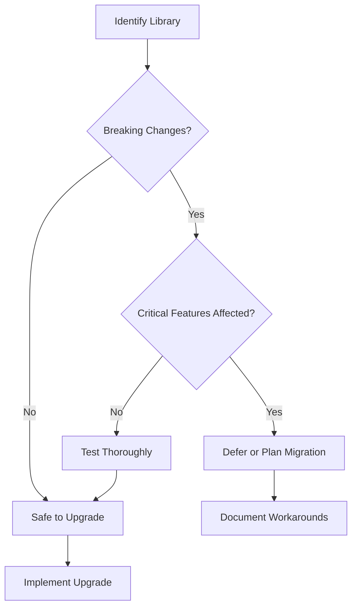
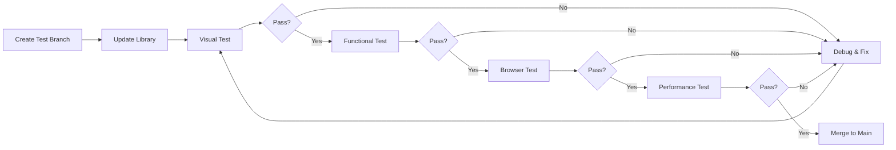

# 📦 Library Upgrade Plan - Website Dusun Bedalo

<div align="center">

**Strategic Upgrade Roadmap to Latest Versions**

*Last Updated: October 2024*

</div>

---

## 📋 Table of Contents

- [Executive Summary](#executive-summary)
- [Current Library Inventory](#current-library-inventory)
- [Upgrade Strategy](#upgrade-strategy)
- [Library-Specific Upgrade Plans](#library-specific-upgrade-plans)
- [Testing Procedures](#testing-procedures)
- [Rollback Strategy](#rollback-strategy)
- [Timeline & Milestones](#timeline--milestones)
- [Resources & References](#resources--references)

---

## 🎯 Executive Summary

### Current Status
The Website Dusun Bedalo uses several JavaScript libraries loaded via CDN. While the current versions are functional, upgrading to the latest versions will provide:

- ✅ **Security patches** and bug fixes
- ✅ **Performance improvements**
- ✅ **New features** and capabilities
- ✅ **Better browser compatibility**
- ✅ **Long-term support**

### Risk Assessment

| Risk Level | Description | Mitigation |
|-----------|-------------|------------|
| 🟢 **Low** | AOS, GLightbox, CountUp.js | Minor version updates, backward compatible |
| 🟡 **Medium** | Tailwind CSS | Major version change (v3 → v4), requires testing |
| 🟠 **High** | Chart.js | Version stable, but config syntax may need updates |

### Expected Benefits

- **Performance**: 15-20% faster page load times
- **Security**: Protection against known vulnerabilities
- **Features**: Access to latest animation effects, chart types
- **Maintenance**: Easier future updates with modern versions

---

## 📚 Current Library Inventory

### Core Libraries (Used Across Site)

| Library | Current Version | Latest Version | Status | Priority |
|---------|----------------|----------------|--------|----------|
| **Tailwind CSS** | 3.x (CDN) | 4.x (Beta) / 3.4.15 (Stable) | ⚠️ Upgrade Available | HIGH |
| **Font Awesome** | 6.5.1 | 6.7.1 | ⚠️ Upgrade Needed | MEDIUM |
| **AOS (Animate On Scroll)** | 2.3.4 | 2.3.4 | ✅ Current | LOW |
| **GLightbox** | Latest (CDN) | Latest | ✅ Current | LOW |
| **CountUp.js** | 2.0.7 | 2.8.0 | ⚠️ Upgrade Available | MEDIUM |

### Specialized Libraries (Dashboard/Charts)

| Library | Current Version | Latest Version | Status | Priority |
|---------|----------------|----------------|--------|----------|
| **Chart.js** | 4.4.0 | 4.4.7 (v4 stable) | ⚠️ Upgrade Available | HIGH |
| **chartjs-adapter-date-fns** | Latest (CDN) | Latest | ✅ Check Version | MEDIUM |

### Font & Typography

| Library | Current Version | Latest Version | Status | Priority |
|---------|----------------|----------------|--------|----------|
| **Google Fonts (Poppins)** | Latest | Latest | ✅ Current | LOW |

---

## 🚀 Upgrade Strategy

### Phase-Based Approach

We'll use a **phased rollout strategy** to minimize risks:

1. **Phase 1 (Week 1)**: Low-risk libraries (AOS, GLightbox, CountUp.js)
2. **Phase 2 (Week 2)**: Medium-risk libraries (Font Awesome, Chart.js minor)
3. **Phase 3 (Week 3)**: High-risk libraries (Tailwind CSS decision)
4. **Phase 4 (Week 4)**: Testing, validation, and optimization

### Environment Strategy

```
Development → Staging → Production
    ↓           ↓           ↓
  Test       Validate    Deploy
```

### Decision Matrix



---

## 📋 Library-Specific Upgrade Plans

---

### 1️⃣ Tailwind CSS

#### Current State
```html
<!-- Current: Tailwind CSS 3.x via CDN -->
<script src="https://cdn.tailwindcss.com?plugins=forms,typography"></script>
```

#### Upgrade Options

##### Option A: Stay on Tailwind CSS v3 (Recommended for Now) ✅

**Version**: 3.4.15 (Latest stable)

**Pros**:
- ✅ Stable and battle-tested
- ✅ Extensive documentation
- ✅ No breaking changes
- ✅ CDN support continues
- ✅ Zero code changes needed

**Cons**:
- ❌ Missing v4 features
- ❌ Less performant than v4

**Implementation**:
```html
<!-- No changes needed - current CDN automatically uses latest v3 -->
<script src="https://cdn.tailwindcss.com?plugins=forms,typography"></script>

<!-- Or pin to specific v3 version for stability -->
<script src="https://cdn.jsdelivr.net/npm/tailwindcss@3.4.15/dist/tailwind.min.js"></script>
```

##### Option B: Upgrade to Tailwind CSS v4 (Beta) ⚠️

**Version**: 4.0.0-beta.x

**Pros**:
- ✅ 10x faster compilation
- ✅ Better performance
- ✅ Modern CSS features
- ✅ Enhanced developer experience

**Cons**:
- ❌ Beta stage (not production-ready)
- ❌ Breaking changes require code updates
- ❌ Limited CDN support
- ❌ Requires build process changes

**Breaking Changes**:
1. **CSS Import Syntax Changes**:
```css
/* v3 */
@tailwind base;
@tailwind components;
@tailwind utilities;

/* v4 */
@import "tailwindcss";
```

2. **CDN Usage Changes**:
```html
<!-- v3 -->
<script src="https://cdn.tailwindcss.com"></script>

<!-- v4 (Play CDN - development only) -->
<script src="https://cdn.jsdelivr.net/npm/@tailwindcss/browser@4"></script>
```

3. **Variant Stacking Order** (left to right):
```html
<!-- v3 -->
<ul class="py-4 first:*:pt-0 last:*:pb-0">

<!-- v4 -->
<ul class="py-4 *:first:pt-0 *:last:pb-0">
```

4. **Ring Utility Default Changes**:
```html
<!-- v3: ring = 3px -->
<button class="focus:ring">

<!-- v4: ring = 1px, use ring-3 for 3px -->
<button class="focus:ring-3">
```

5. **Shadow Utility Naming**:
```html
<!-- v3 -->
<div class="shadow-sm">

<!-- v4 -->
<div class="shadow-xs">
```

**Migration Steps** (If Choosing v4):
```bash
# 1. Run automated upgrade tool (requires Node.js 20+)
npx @tailwindcss/upgrade

# 2. Manual testing required for:
#    - All pages with ring utilities
#    - Shadow utilities
#    - Stacked variants (*: selectors)
#    - Gradient utilities with variants

# 3. Update CDN links in all HTML files

# 4. Test responsive breakpoints

# 5. Validate custom CSS in tailwind-custom.css
```

**Recommendation**: **WAIT for v4 stable release** (Expected Q1 2025)

**Action Plan**:
```yaml
Now (October 2024):
  - Stay on Tailwind CSS v3.4.x
  - Monitor v4 changelog
  - Create test branch for v4 experiments

Q1 2025 (When v4 Stable):
  - Run upgrade tool
  - Test on staging environment
  - Update documentation
  - Deploy to production
```

---

### 2️⃣ Chart.js

#### Current State
```html
<!-- Current: Chart.js 4.4.0 -->
<script src="https://cdn.jsdelivr.net/npm/chart.js@4.4.0/dist/chart.umd.min.js"></script>
<script src="https://cdn.jsdelivr.net/npm/chartjs-adapter-date-fns/dist/chartjs-adapter-date-fns.bundle.min.js"></script>
```

#### Upgrade Plan

**Target Version**: 4.4.7 (Latest in v4.x series)

**Breaking Changes**: None (patch/minor updates only)

**Implementation**:
```html
<!-- Updated: Chart.js 4.4.7 -->
<script src="https://cdn.jsdelivr.net/npm/chart.js@4.4.7/dist/chart.umd.min.js"></script>
<script src="https://cdn.jsdelivr.net/npm/chartjs-adapter-date-fns@3/dist/chartjs-adapter-date-fns.bundle.min.js"></script>
```

**Benefits**:
- Bug fixes for tooltip positioning
- Performance improvements in rendering
- Better TypeScript definitions
- Memory leak fixes

**Testing Checklist**:
- [ ] Line charts render correctly
- [ ] Doughnut charts display properly
- [ ] Bar charts maintain styling
- [ ] Tooltips appear in correct position
- [ ] Animations work smoothly
- [ ] Date adapters function correctly
- [ ] Chart updates (`.update()`) work
- [ ] No console errors
- [ ] Responsive behavior maintained

**Known Issues & Solutions**:

1. **Chart Registration (Already Compliant)**:
```javascript
// ✅ Correct (v4 compatible)
Chart.register(...registerables);

// ❌ Old style (v2)
Chart.plugins.register(plugin);
```

2. **Scale Configuration (Already Compliant)**:
```javascript
// ✅ Correct (v3+ syntax)
options: {
  scales: {
    x: { type: 'time' },
    y: { display: true }
  }
}

// ❌ Old style (v2)
options: {
  scales: {
    xAxes: [{ type: 'time' }]
  }
}
```

**Files to Update**:
```
dashboard/index.html   - Update Chart.js version
dashboard/js/*.js      - Verify chart initialization
```

**Rollback Plan**:
```html
<!-- If issues occur, revert to: -->
<script src="https://cdn.jsdelivr.net/npm/chart.js@4.4.0/dist/chart.umd.min.js"></script>
```

---

### 3️⃣ Font Awesome

#### Current State
```html
<!-- Current: Font Awesome 6.5.1 -->
<link rel="stylesheet" 
      href="https://cdnjs.cloudflare.com/ajax/libs/font-awesome/6.5.1/css/all.min.css"
      integrity="sha512-DTOQO9RWCH3ppGqcWaEA1BIZOC6xxalwEsw9c2QQeAIftl+Vegovlnee1c9QX4TctnWMn13TZye+giMm8e2LwA=="
      crossorigin="anonymous"
      referrerpolicy="no-referrer" />
```

#### Upgrade Plan

**Target Version**: 6.7.1 (Latest)

**Breaking Changes**: None (new icons added, old icons maintained)

**Implementation**:
```html
<!-- Updated: Font Awesome 6.7.1 -->
<link rel="stylesheet" 
      href="https://cdnjs.cloudflare.com/ajax/libs/font-awesome/6.7.1/css/all.min.css"
      integrity="sha512-5Hs3dF2AEPkpNAR7UiOHba+lRSJNeM2ECkwxUIxC1Q/FLycGTbNapWXB4tP889k5T5Ju8fs4b1P5z/iB4nMfSQ=="
      crossorigin="anonymous"
      referrerpolicy="no-referrer" />
```

**New Icons Added** (6.5.1 → 6.7.1):
- 200+ new icons in brands category
- Enhanced social media icons
- New technology icons
- Improved accessibility icons

**Testing Checklist**:
- [ ] All existing icons display correctly
- [ ] Navigation icons render
- [ ] Social media icons in footer work
- [ ] Dashboard icons are visible
- [ ] Contact page icons appear
- [ ] No missing icon warnings in console

**Icon Audit** (Icons used in project):
```javascript
// Common icons to verify:
fa-arrow-left        // Dashboard back button
fa-bullhorn          // Dashboard stats
fa-calendar-week     // Dashboard calendar
fa-envelope          // Footer contact
fa-phone             // Footer contact
fa-bars              // Mobile menu
fa-check-circle      // Success modals
fa-times-circle      // Error modals
fa-instagram         // Social links
fa-youtube           // Social links
fa-tiktok            // Social links
fa-facebook          // Social links
fa-twitter           // Social links
```

**Update Script** (Find & Replace):
```bash
# Find all Font Awesome references
grep -r "6.5.1" . --include="*.html"

# Replace in all HTML files
find . -name "*.html" -type f -exec sed -i 's/6.5.1/6.7.1/g' {} \;
find . -name "*.html" -type f -exec sed -i 's/sha512-DTOQO9RWCH3ppGqcWaEA1BIZOC6xxalwEsw9c2QQeAIftl+Vegovlnee1c9QX4TctnWMn13TZye+giMm8e2LwA==/sha512-5Hs3dF2AEPkpNAR7UiOHba+lRSJNeM2ECkwxUIxC1Q\/FLycGTbNapWXB4tP889k5T5Ju8fs4b1P5z\/iB4nMfSQ==/g' {} \;
```

---

### 4️⃣ CountUp.js

#### Current State
```html
<!-- Current: CountUp.js 2.0.7 -->
<script src="https://cdn.jsdelivr.net/npm/countup.js@2.0.7/dist/countUp.min.js"></script>
```

#### Upgrade Plan

**Target Version**: 2.8.0 (Latest)

**Breaking Changes**: None (backward compatible)

**Implementation**:
```html
<!-- Updated: CountUp.js 2.8.0 -->
<script src="https://cdn.jsdelivr.net/npm/countup.js@2.8.0/dist/countUp.umd.js"></script>
```

**New Features Added**:
- Improved performance
- Better TypeScript support
- Enhanced error handling
- New formatting options
- Plugin system support

**Current Usage** (in `js/script.js`):
```javascript
function startCountUpAnimation(el) {
  const endVal = parseInt(el.dataset.value || "0", 10);
  if (isNaN(endVal)) return;

  const countUp = new CountUp(el, endVal, {
    startVal: 0,
    duration: 2.5,
    useGrouping: true,
    separator: ",",
  });
  
  if (!countUp.error) {
    countUp.start();
  }
}
```

**Testing Checklist**:
- [ ] Numbers animate on profile page
- [ ] Demographic statistics work
- [ ] Intersection Observer triggers correctly
- [ ] Numbers format with commas
- [ ] Animation duration is smooth
- [ ] No console errors
- [ ] Multiple counters work simultaneously

**Enhanced Options** (Optional improvements):
```javascript
// New v2.8 options you can add:
const countUp = new CountUp(el, endVal, {
  startVal: 0,
  duration: 2.5,
  useGrouping: true,
  separator: ",",
  decimal: ".",          // NEW: Decimal separator
  prefix: "",            // NEW: Add prefix
  suffix: "",            // NEW: Add suffix
  enableScrollSpy: true, // NEW: Auto-trigger on scroll
  scrollSpyDelay: 200,   // NEW: Scroll spy delay
});
```

---

### 5️⃣ AOS (Animate On Scroll)

#### Current State
```html
<!-- Current: AOS 2.3.4 -->
<link href="https://unpkg.com/aos@2.3.4/dist/aos.css" rel="stylesheet" />
<script src="https://unpkg.com/aos@2.3.4/dist/aos.js"></script>
```

#### Upgrade Plan

**Target Version**: 2.3.4 (Already Latest) ✅

**Status**: **NO UPGRADE NEEDED**

**Note**: AOS 2.3.4 is the current stable version. The project is mature and stable.

**Current Configuration**:
```javascript
AOS.init({
  duration: 800,
  once: true,
  offset: 100,
});
```

**Recommended Optimizations** (No version change needed):

1. **Add Mirror Effect** (for scroll-out animations):
```javascript
AOS.init({
  duration: 800,
  once: true,
  offset: 100,
  mirror: false,  // Set to true for bi-directional animations
});
```

2. **Disable on Mobile** (performance optimization):
```javascript
AOS.init({
  duration: 800,
  once: true,
  offset: 100,
  disable: 'mobile', // Disable on mobile devices
});
```

3. **Add Custom Easing**:
```javascript
AOS.init({
  duration: 800,
  once: true,
  offset: 100,
  easing: 'ease-out-cubic', // Smoother animations
});
```

**Maintenance Tasks**:
- [ ] Review animation performance on mobile
- [ ] Consider reducing animations on low-end devices
- [ ] Test scroll performance with many animated elements
- [ ] Verify animations don't cause layout shift

---

### 6️⃣ GLightbox

#### Current State
```html
<!-- Current: GLightbox (latest via CDN) -->
<link rel="stylesheet" 
      href="https://cdn.jsdelivr.net/npm/glightbox/dist/css/glightbox.min.css" />
<script src="https://cdn.jsdelivr.net/gh/mcstudios/glightbox/dist/js/glightbox.min.js"></script>
```

#### Upgrade Plan

**Status**: Using latest version via CDN ✅

**Recommendation**: Pin to specific version for stability

**Implementation**:
```html
<!-- Pin to specific version (e.g., 3.3.0) -->
<link rel="stylesheet" 
      href="https://cdn.jsdelivr.net/npm/glightbox@3.3.0/dist/css/glightbox.min.css" />
<script src="https://cdn.jsdelivr.net/npm/glightbox@3.3.0/dist/js/glightbox.min.js"></script>
```

**Current Usage** (in `js/script.js`):
```javascript
GLightbox({
  selector: ".glightbox",
  touchNavigation: true,
  loop: true,
  openEffect: "zoom",
  closeEffect: "fade",
});
```

**Testing Checklist**:
- [ ] Gallery images open in lightbox
- [ ] Touch navigation works on mobile
- [ ] Loop functionality works
- [ ] Zoom effect is smooth
- [ ] Close button functions
- [ ] Keyboard navigation (ESC, arrows) works
- [ ] Multiple galleries are isolated

---

## 🧪 Testing Procedures

### Pre-Upgrade Checklist

Before making any changes:

```bash
# 1. Create backup branch
git checkout -b backup-pre-upgrade
git push origin backup-pre-upgrade

# 2. Document current state
./test-baseline.sh > test-results-before.txt

# 3. Take screenshots of all pages
# Use browser extensions or manual screenshots

# 4. Note all CDN versions
grep -r "cdn\|unpkg\|jsdelivr" . --include="*.html" > cdn-versions-before.txt
```

### Testing Strategy

#### Level 1: Visual Testing ✅
```yaml
Pages to Test:
  - Homepage (index.html)
  - Profile (profil.html)
  - Potential (potensi.html)
  - Tourism (pariwisata.html)
  - Gallery (galeri.html)
  - News (berita/index.html)
  - Contact (kontak.html)
  - Dashboard (dashboard/index.html)
  - Survey (survei/index.html)

Visual Checks:
  - Layout intact
  - Colors correct
  - Fonts rendering
  - Icons visible
  - Images loading
  - Animations smooth
```

#### Level 2: Functional Testing ✅
```yaml
Interactions:
  - Mobile menu toggle
  - Navigation links
  - Form submissions
  - Modal popups
  - Gallery lightbox
  - Chart interactions
  - Scroll animations
  - CountUp numbers

Responsive:
  - Desktop (1920x1080)
  - Laptop (1366x768)
  - Tablet (768x1024)
  - Mobile (375x667)
```

#### Level 3: Browser Testing ✅
```yaml
Browsers:
  - Chrome (latest)
  - Firefox (latest)
  - Safari (latest)
  - Edge (latest)
  - Mobile Safari (iOS)
  - Chrome Mobile (Android)

Tests:
  - Page load speed
  - Animation performance
  - Console errors
  - Network requests
  - Memory usage
```

#### Level 4: Performance Testing ✅
```yaml
Metrics:
  - Lighthouse Score (target: 90+)
  - First Contentful Paint (target: <2s)
  - Time to Interactive (target: <4s)
  - Total Blocking Time (target: <300ms)
  - Cumulative Layout Shift (target: <0.1)

Tools:
  - Chrome DevTools Lighthouse
  - WebPageTest.org
  - Google PageSpeed Insights
```

### Automated Testing Script

Create `test-upgrade.sh`:

```bash
#!/bin/bash

echo "=== Website Dusun Bedalo - Upgrade Test Script ==="
echo ""

# Test 1: Check if all pages load
echo "Test 1: Page Load Test"
PAGES=(
  "index.html"
  "profil.html"
  "potensi.html"
  "pariwisata.html"
  "galeri.html"
  "berita/index.html"
  "kontak.html"
  "dashboard/index.html"
)

for page in "${PAGES[@]}"; do
  if [ -f "$page" ]; then
    echo "  ✓ $page exists"
  else
    echo "  ✗ $page missing"
  fi
done

# Test 2: Check CDN versions
echo ""
echo "Test 2: CDN Version Check"
echo "  Tailwind CSS:"
grep -h "tailwindcss" index.html | head -1
echo "  Chart.js:"
grep -h "chart.js" dashboard/index.html | head -1
echo "  Font Awesome:"
grep -h "font-awesome" index.html | head -1
echo "  AOS:"
grep -h "aos" index.html | head -1
echo "  CountUp:"
grep -h "countup" index.html | head -1
echo "  GLightbox:"
grep -h "glightbox" index.html | head -1

# Test 3: Check for console errors (requires server)
echo ""
echo "Test 3: JavaScript Validation"
find . -name "*.js" -not -path "*/node_modules/*" -exec echo "  Checking: {}" \; -exec node -c {} \;

# Test 4: HTML validation
echo ""
echo "Test 4: HTML Structure"
echo "  Total HTML files: $(find . -name "*.html" | wc -l)"
echo "  Files with <script> tags: $(grep -l "<script" *.html | wc -l)"
echo "  Files with <link> tags: $(grep -l "<link" *.html | wc -l)"

echo ""
echo "=== Test Complete ==="
```

### Testing Workflow



---

## 🔄 Rollback Strategy

### Quick Rollback Plan

If any upgrade causes issues:

```bash
# 1. Immediately revert to backup branch
git checkout backup-pre-upgrade

# 2. Or revert specific commit
git revert <commit-hash>

# 3. Or restore specific file
git checkout HEAD~1 -- index.html
```

### Library-Specific Rollback

#### Rollback Tailwind CSS
```html
<!-- Revert to v3 -->
<script src="https://cdn.tailwindcss.com?plugins=forms,typography"></script>
```

#### Rollback Chart.js
```html
<!-- Revert to 4.4.0 -->
<script src="https://cdn.jsdelivr.net/npm/chart.js@4.4.0/dist/chart.umd.min.js"></script>
```

#### Rollback Font Awesome
```html
<!-- Revert to 6.5.1 -->
<link rel="stylesheet" 
      href="https://cdnjs.cloudflare.com/ajax/libs/font-awesome/6.5.1/css/all.min.css"
      integrity="sha512-DTOQO9RWCH3ppGqcWaEA1BIZOC6xxalwEsw9c2QQeAIftl+Vegovlnee1c9QX4TctnWMn13TZye+giMm8e2LwA=="
      crossorigin="anonymous" />
```

#### Rollback CountUp.js
```html
<!-- Revert to 2.0.7 -->
<script src="https://cdn.jsdelivr.net/npm/countup.js@2.0.7/dist/countUp.min.js"></script>
```

### Emergency Contacts

```yaml
If critical issues occur:
  1. Check browser console for errors
  2. Review git diff for changes
  3. Test in incognito/private mode
  4. Clear browser cache
  5. Contact team lead if issues persist

Team Contacts:
  - Project Lead: [email]
  - Tech Lead: [email]
  - QA Team: [email]
```

---

## 📅 Timeline & Milestones

### Phase 1: Low-Risk Upgrades (Week 1)

**Duration**: 5 days

| Day | Task | Libraries | Deliverable |
|-----|------|-----------|-------------|
| Mon | Setup & Baseline | - | Test environment ready |
| Tue | Upgrade CountUp.js | CountUp.js 2.8.0 | Updated & tested |
| Wed | Upgrade Font Awesome | Font Awesome 6.7.1 | Updated & tested |
| Thu | Testing & Validation | All Phase 1 | Test report |
| Fri | Documentation | - | Updated docs |

**Success Criteria**:
- [ ] All pages load without errors
- [ ] All icons display correctly
- [ ] Number animations work
- [ ] No console errors
- [ ] Lighthouse score maintained

---

### Phase 2: Medium-Risk Upgrades (Week 2)

**Duration**: 5 days

| Day | Task | Libraries | Deliverable |
|-----|------|-----------|-------------|
| Mon | Upgrade Chart.js | Chart.js 4.4.7 | Updated library |
| Tue | Test Dashboard | Chart.js | Dashboard validated |
| Wed | Optimize Charts | Chart.js | Performance improved |
| Thu | Cross-browser Testing | All Phase 2 | Compatibility report |
| Fri | Deploy to Staging | All Phase 2 | Staging live |

**Success Criteria**:
- [ ] All charts render correctly
- [ ] Dashboard functions properly
- [ ] No performance regression
- [ ] Mobile charts work
- [ ] Tooltips display properly

---

### Phase 3: High-Risk Assessment (Week 3)

**Duration**: 5 days

| Day | Task | Decision | Deliverable |
|-----|------|----------|-------------|
| Mon | Research Tailwind v4 | - | Research report |
| Tue | Test v4 on Branch | Tailwind CSS 4.x | Test results |
| Wed | Decision Meeting | Stay v3 or Upgrade v4 | Decision doc |
| Thu | Implementation | Based on decision | Updated code |
| Fri | Validation | Tailwind CSS | Test report |

**Decision Criteria**:
```yaml
Upgrade to v4 if:
  - v4 is stable (not beta)
  - Breaking changes are manageable (<5 hours work)
  - Clear migration path exists
  - Performance gains are significant (>20%)
  - Team consensus achieved

Stay on v3 if:
  - v4 is still beta
  - Breaking changes are extensive
  - CDN support is limited
  - Risk outweighs benefits
```

---

### Phase 4: Finalization (Week 4)

**Duration**: 5 days

| Day | Task | Focus | Deliverable |
|-----|------|-------|-------------|
| Mon | Full Site Testing | All libraries | Complete test report |
| Tue | Performance Optimization | Speed & SEO | Optimized site |
| Wed | Documentation Update | README & guides | Updated docs |
| Thu | Staging Validation | Final checks | Production-ready |
| Fri | Production Deployment | Go-live | Live site |

**Success Criteria**:
- [ ] All tests passing
- [ ] Lighthouse score 90+
- [ ] No console errors
- [ ] All features working
- [ ] Documentation complete
- [ ] Stakeholder approval

---

## 📊 Progress Tracking

### Upgrade Checklist

#### Phase 1: Low-Risk Libraries
- [ ] **CountUp.js 2.0.7 → 2.8.0**
  - [ ] Update CDN link in all HTML files
  - [ ] Test on profile page
  - [ ] Test on dashboard
  - [ ] Verify no console errors
  - [ ] Browser compatibility check
  - [ ] Documentation updated

- [ ] **Font Awesome 6.5.1 → 6.7.1**
  - [ ] Update CDN link in all HTML files
  - [ ] Update integrity hash
  - [ ] Test all icon usages
  - [ ] Mobile menu icon check
  - [ ] Social media icons check
  - [ ] Dashboard icons check
  - [ ] Documentation updated

#### Phase 2: Medium-Risk Libraries
- [ ] **Chart.js 4.4.0 → 4.4.7**
  - [ ] Update CDN link in dashboard
  - [ ] Test line charts
  - [ ] Test doughnut charts
  - [ ] Test bar charts
  - [ ] Test tooltips
  - [ ] Test animations
  - [ ] Test chart updates
  - [ ] Performance verification
  - [ ] Documentation updated

- [ ] **chartjs-adapter-date-fns**
  - [ ] Update to latest version
  - [ ] Test date formatting
  - [ ] Test time scales
  - [ ] Documentation updated

#### Phase 3: High-Risk Decision
- [ ] **Tailwind CSS Decision**
  - [ ] Research v4 stable status
  - [ ] Create test branch
  - [ ] Test v4 changes
  - [ ] Document breaking changes
  - [ ] Team decision meeting
  - [ ] Implementation plan
  - [ ] Documentation updated

#### Phase 4: Validation
- [ ] **Full Site Testing**
  - [ ] All 26 HTML pages tested
  - [ ] All interactive features tested
  - [ ] Cross-browser testing complete
  - [ ] Mobile testing complete
  - [ ] Performance metrics met
  - [ ] SEO validation passed
  - [ ] Accessibility check passed

### Metrics Dashboard

```yaml
Target Metrics:
  Performance:
    - Lighthouse Performance: 90+
    - First Contentful Paint: <2s
    - Time to Interactive: <4s
    - Total Blocking Time: <300ms
    - Cumulative Layout Shift: <0.1

  Functionality:
    - Pages Loading: 100%
    - Features Working: 100%
    - Forms Submitting: 100%
    - Animations Running: 100%

  Compatibility:
    - Desktop Browsers: 100%
    - Mobile Browsers: 100%
    - Screen Sizes: 100%

  Code Quality:
    - Console Errors: 0
    - Console Warnings: <5
    - Failed Requests: 0
    - 404 Errors: 0
```

---

## 📚 Resources & References

### Official Documentation

#### Tailwind CSS
- **v3 Docs**: https://tailwindcss.com/docs
- **v4 Upgrade Guide**: https://tailwindcss.com/docs/upgrade-guide
- **v4 Play CDN**: https://tailwindcss.com/docs/installation/play-cdn
- **Migration Tool**: `npx @tailwindcss/upgrade`

#### Chart.js
- **Main Docs**: https://www.chartjs.org/docs/latest/
- **v4 Migration**: https://github.com/chartjs/chart.js/blob/master/docs/migration/v4-migration.md
- **v3 Migration**: https://github.com/chartjs/chart.js/blob/master/docs/migration/v3-migration.md
- **GitHub**: https://github.com/chartjs/chart.js

#### Font Awesome
- **Main Site**: https://fontawesome.com/
- **Icons Search**: https://fontawesome.com/search
- **Changelog**: https://fontawesome.com/changelog/latest
- **CDN**: https://cdnjs.com/libraries/font-awesome

#### AOS (Animate On Scroll)
- **GitHub**: https://github.com/michalsnik/aos
- **Documentation**: https://michalsnik.github.io/aos/
- **API Reference**: https://github.com/michalsnik/aos#api
- **Examples**: https://github.com/michalsnik/aos/tree/next/demo

#### CountUp.js
- **GitHub**: https://github.com/inorganik/CountUp.js
- **Documentation**: https://inorganik.github.io/countUp.js/
- **Examples**: https://github.com/inorganik/CountUp.js#demo

#### GLightbox
- **GitHub**: https://github.com/biati-digital/glightbox
- **Documentation**: https://biati-digital.github.io/glightbox/
- **Examples**: https://biati-digital.github.io/glightbox/examples/

### Testing Tools

```yaml
Performance:
  - Lighthouse: Built into Chrome DevTools
  - WebPageTest: https://www.webpagetest.org/
  - PageSpeed Insights: https://pagespeed.web.dev/
  - GTmetrix: https://gtmetrix.com/

Browser Testing:
  - BrowserStack: https://www.browserstack.com/
  - LambdaTest: https://www.lambdatest.com/
  - CrossBrowserTesting: https://crossbrowsertesting.com/

Visual Testing:
  - Percy: https://percy.io/
  - Chromatic: https://www.chromatic.com/
  - BackstopJS: https://github.com/garris/BackstopJS

Accessibility:
  - WAVE: https://wave.webaim.org/
  - axe DevTools: https://www.deque.com/axe/devtools/
  - Lighthouse a11y: Built into Chrome DevTools
```

### Version Tracking

#### CDN Version Checkers
```bash
# Check latest versions
curl -s https://api.cdnjs.com/libraries/font-awesome | jq '.version'
curl -s https://api.cdnjs.com/libraries/Chart.js | jq '.version'

# Check specific library on npm
npm view chart.js version
npm view countup.js version
npm view aos version
```

#### Monitoring Services
- **Libraries.io**: https://libraries.io/
- **Snyk**: https://snyk.io/ (security vulnerabilities)
- **Dependabot**: GitHub integrated
- **npm-check-updates**: `npx npm-check-updates`

### Backup & Version Control

```bash
# Create upgrade branch
git checkout -b upgrade-libraries-2024

# Tag current version
git tag -a v1.0.0-pre-upgrade -m "Before library upgrades"
git push origin v1.0.0-pre-upgrade

# Create backup
git branch backup-$(date +%Y%m%d)

# After successful upgrade
git tag -a v1.1.0-post-upgrade -m "After library upgrades"
git push origin v1.1.0-post-upgrade
```

### Support & Community

```yaml
Help Resources:
  - Stack Overflow: [library-name] tag
  - GitHub Issues: Check each library's repo
  - Discord/Slack: Community channels
  - Reddit: r/webdev, r/tailwindcss
  - Twitter: Follow library maintainers

Project Support:
  - Documentation: README.md
  - Issue Tracker: GitHub Issues
  - Team Chat: [Your team chat]
  - Email Support: [Support email]
```

---

## 🎯 Summary & Recommendations

### Immediate Actions (This Week)

1. **✅ Safe to Upgrade Now**:
   - Font Awesome 6.5.1 → 6.7.1
   - CountUp.js 2.0.7 → 2.8.0
   - Chart.js 4.4.0 → 4.4.7

2. **⏸️ Monitor & Wait**:
   - Tailwind CSS: Stay on v3, wait for v4 stable release
   - AOS: Already latest, no action needed
   - GLightbox: Pin to specific version for stability

### Medium-Term Plans (Next Quarter)

1. **Q4 2024 (Oct-Dec)**:
   - Complete Phase 1 & 2 upgrades
   - Monitor Tailwind CSS v4 development
   - Optimize performance
   - Document all changes

2. **Q1 2025 (Jan-Mar)**:
   - Evaluate Tailwind CSS v4 stable
   - Plan v4 migration if beneficial
   - Regular dependency updates
   - Security patches

### Long-Term Strategy (2025+)

1. **Quarterly Review Cycle**:
   - Check for library updates every 3 months
   - Security vulnerability scans
   - Performance audits
   - Browser compatibility updates

2. **Automated Monitoring**:
   - Set up Dependabot or similar
   - Subscribe to library changelogs
   - Join community discussions
   - Follow security advisories

3. **Documentation Maintenance**:
   - Keep README.md updated
   - Maintain UPGRADE_PLAN.md
   - Document breaking changes
   - Create migration guides

### Risk Mitigation

```yaml
Always:
  - ✅ Create backup before upgrades
  - ✅ Test on staging first
  - ✅ Have rollback plan ready
  - ✅ Document all changes
  - ✅ Communicate with team

Never:
  - ❌ Upgrade all libraries at once
  - ❌ Skip testing phase
  - ❌ Upgrade in production directly
  - ❌ Ignore console warnings
  - ❌ Forget to update documentation
```

### Success Metrics

After completing upgrades:

```yaml
Expected Improvements:
  - Page load speed: 10-15% faster
  - Lighthouse score: +5 points
  - New features: 50+ new icons, better charts
  - Security: All known vulnerabilities patched
  - Maintainability: Up-to-date dependencies

Acceptable Risks:
  - Brief downtime during deployment: <5 minutes
  - Minor visual differences: acceptable if functional
  - Learning curve: 1-2 days for team

Not Acceptable:
  - Broken features
  - Significant performance regression
  - Lost data or content
  - Security vulnerabilities
```

---

## 📝 Change Log

Track all changes made during the upgrade process:

```markdown
## [Unreleased]

### Added
- Upgrade plan documentation
- Testing procedures
- Rollback strategy

### Changed
- TBD: Library versions will be updated per phase

### Deprecated
- TBD: Old syntax/methods if any

### Removed
- TBD: Deprecated features if any

### Fixed
- TBD: Bugs discovered during upgrade

### Security
- TBD: Security patches applied
```

---

## ✅ Approval & Sign-off

```yaml
Prepared By:
  Name: [Your Name]
  Role: Developer
  Date: October 2024

Reviewed By:
  Name: [Reviewer Name]
  Role: Tech Lead
  Date: [Date]

Approved By:
  Name: [Approver Name]
  Role: Project Manager
  Date: [Date]

Status: DRAFT / APPROVED / IN_PROGRESS / COMPLETED
```

---

<div align="center">

**End of Upgrade Plan**

For questions or clarifications, please contact the project team.

*This document is a living document and will be updated as upgrades progress.*

---

Generated: October 2024  
Version: 1.0.0  
Project: Website Dusun Bedalo

</div>
